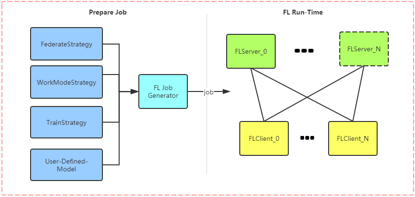

# Galaxy Learning Framework

Galaxy learning is a federated learning system based on blockchain and PFL(Federated learning framework based on pytorch). 
At present, the PFL part is open-source first, and the blockchain part will be open-source soon. 
In addition to the traditional federate learning algorithm, PFL also provides a new federated learning algorithm 
based on model distillation. Developers can choose different federated learning algorithm to train their model.


## Framework Design

> The framework design reference PaddleFL

**Prepare Job**
> When we want to use PFL, we need to specify several strategies and generate FL jobs.
- FederateStrategy: To specify federated learning algorithm(`FedAvg` or `Model Distillation`).
- WorkModeStrategy: To specify work mode(standalone or cluster).
- TrainStrategy: To specify train details in federated learning.
- User-Defined-Model: To specify the model in federated learning. 


**FL Run-Time**
> If we have prepared the FL job, we can use this job to start FL task. one FL client can 
>participate in multiple FL tasks and one FL client can communicate with multiple FL Servers
- FLServer: if we use `FedAvg` as our federated learning algorithm, then the FlServer is responsible for synchronizing
temporary model parameters from various FLClients and aggregating these model parameters from various FLClients each step.
if we use `Model Distillation` as our federated learning algorithm, the the FlServer is just responsible for synchronizing
temporary model parameters from various FLClients. 
- FLClient: The FLClient is responsible for training User-Defined-Model and commuticating with various FLServers. If we use 
`Model distillation` as our federated learning algorithm, then the FLClient is also responsible for model distillation.


## Install And Quick Start Guide

### Install PFL Framework
```python
pip install pfl >= 0.1.2
```

### Quick Start Guide

As a FLServer, we need to run fl_model.py to generate FL Job and then run fl_server.py.<br>
As a FLClient, we just need to run fl_client.py.
#### Standalone work mode

fl_model.py
```python
from torch import nn
import torch.nn.functional as F
import pfl.core.strategy as strategy
from pfl.core.job_manager import JobManager


class Net(nn.Module):
    def __init__(self):
        super(Net, self).__init__()
        self.conv1 = nn.Conv2d(1, 20, 5, 1)
        self.conv2 = nn.Conv2d(20, 50, 5, 1)
        self.fc1 = nn.Linear(4 * 4 * 50, 500)
        self.fc2 = nn.Linear(500, 10)
        self.softmax = nn.Softmax(dim=1)

    def forward(self, x):
        x = F.relu(self.conv1(x))
        x = F.max_pool2d(x, 2, 2)
        x = F.relu(self.conv2(x))
        x = F.max_pool2d(x, 2, 2)
        x = x.view(-1, 4 * 4 * 50)
        x = F.relu(self.fc1(x))
        x = self.fc2(x)
        return F.softmax(x, dim=1)


if __name__ == "__main__":
    train_code_strategy = strategy.TrainStrategyFatorcy(optimizer=strategy.RunTimeStrategy.OPTIM_SGD,
                                                        learning_rate=0.01,
                                                        loss_function=strategy.RunTimeStrategy.NLL_LOSS, batch_size=32,
                                                        epoch=3)

    model = Net()

    job_manager = JobManager()
    job = job_manager.generate_job(work_mode=strategy.WorkModeStrategy.WORKMODE_STANDALONE,
                                   train_strategy=train_code_strategy,
                                   fed_strategy=strategy.FederateStrategy.FED_AVG, model=Net)
    job_manager.submit_job(job, model)

    
```
fl_client.py
```python
from torchvision import datasets, transforms
from pfl.core.strategy import WorkModeStrategy
from pfl.core.trainer_controller import TrainerController

CLIENT_ID = 0

if __name__ == "__main__":
    # CLIENT_ID = int(sys.argv[1])

    mnist_data = datasets.MNIST("./mnist_data", download=True, train=True, transform=transforms.Compose([
        transforms.ToTensor(),
        transforms.Normalize((0.13066062,), (0.30810776,))
    ]))

    TrainerController(work_mode=WorkModeStrategy.WORKMODE_STANDALONE, data=mnist_data, client_id=CLIENT_ID,
                      concurrent_num=3).start()

```

fl_server.py
```python
from pfl.core.server import FLStandaloneServer
from pfl.core.strategy import FederateStrategy

FEDERATE_STRATEGY = FederateStrategy.FED_AVG

if __name__ == "__main__":

    FLStandaloneServer(FEDERATE_STRATEGY).start()

```
#### Cluster work mode
> In cluster work mode we suggest you set FederateStrategy as `FederateStrategy.FED_AVG` in FLServer at `fl_server.py` to avoid some error in one situation which
> you both have FedAvg jobs and FedDistillation jobs, Because FLServer in FedDistillation work mode will not start an aggregator.
>   


fl_model.py

```python
from torch import nn
import torch.nn.functional as F
import pfl.core.strategy as strategy
from pfl.core.job_manager import JobManager

SERVER_HOST = "http://127.0.0.1:9673"


class Net(nn.Module):
    def __init__(self):
        super(Net, self).__init__()
        self.conv1 = nn.Conv2d(1, 20, 5, 1)
        self.conv2 = nn.Conv2d(20, 50, 5, 1)
        self.fc1 = nn.Linear(4 * 4 * 50, 500)
        self.fc2 = nn.Linear(500, 10)
        self.softmax = nn.Softmax(dim=1)

    def forward(self, x):
        x = F.relu(self.conv1(x))
        x = F.max_pool2d(x, 2, 2)
        x = F.relu(self.conv2(x))
        x = F.max_pool2d(x, 2, 2)
        x = x.view(-1, 4 * 4 * 50)
        x = F.relu(self.fc1(x))
        x = self.fc2(x)
        return F.softmax(x, dim=1)


if __name__ == "__main__":

    train_code_strategy = strategy.TrainStrategyFatorcy(optimizer=strategy.RunTimeStrategy.OPTIM_SGD,
                                                        learning_rate=0.01,
                                                        loss_function=strategy.RunTimeStrategy.NLL_LOSS, batch_size=32,
                                                        epoch=3)
    model = Net()
    job_manager = JobManager()
    job = job_manager.generate_job(work_mode=strategy.WorkModeStrategy.WORKMODE_CLUSTER,
                                   train_strategy=train_code_strategy,
                                   fed_strategy=strategy.FederateStrategy.FED_AVG, model=Net, distillation_alpha=0.5)
    job_manager.submit_job(job, model)

```
fl_client.py
```python
from torchvision import datasets, transforms
from pfl.core.strategy import WorkModeStrategy
from pfl.core.trainer_controller import TrainerController

SERVER_URL = "http://127.0.0.1:9763"
CLIENT_IP = "127.0.0.1"
CLIENT_PORT = 8081
CLIENT_ID = 0


if __name__ == "__main__":
    mnist_data = datasets.MNIST("./mnist_data", download=True, train=True, transform=transforms.Compose([
        transforms.ToTensor(),
        transforms.Normalize((0.13066062,), (0.30810776,))
    ]))

    TrainerController(work_mode=WorkModeStrategy.WORKMODE_CLUSTER, data=mnist_data, client_id=CLIENT_ID,
                      client_ip=CLIENT_IP, client_port=CLIENT_PORT,
                      server_url=SERVER_URL, concurrent_num=3).start()
```
fl_server.py
```python
from pfl.core.server import FLClusterServer
from pfl.core.strategy import FederateStrategy

FEDERATE_STRATEGY = FederateStrategy.FED_DISTILLATION
IP = '0.0.0.0'
PORT = 9763
API_VERSION = '/api/version'

if __name__ == "__main__":

    FLClusterServer(FEDERATE_STRATEGY, IP, PORT, API_VERSION).start()
```

